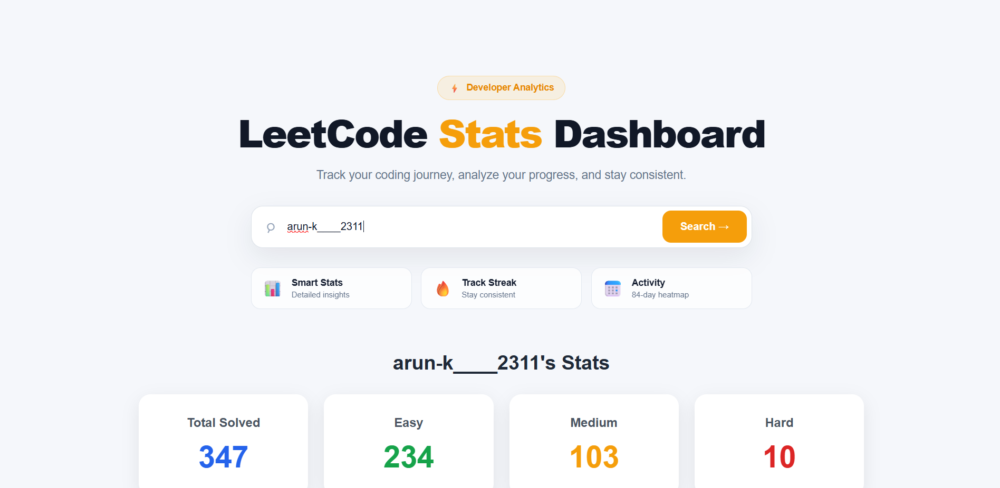
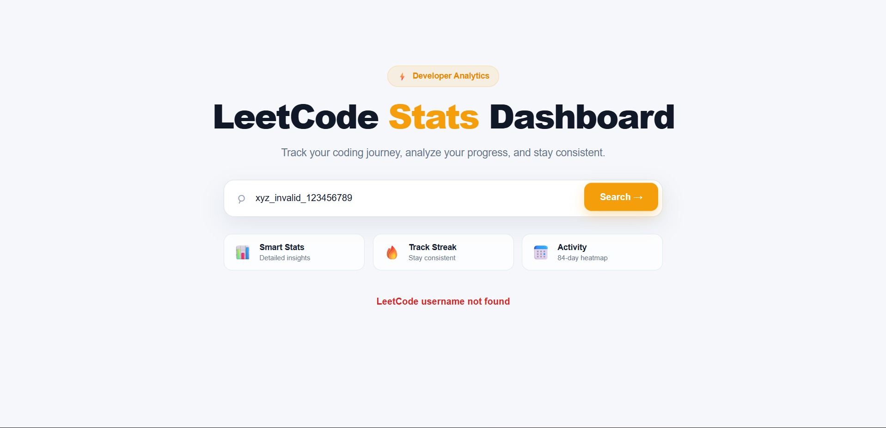
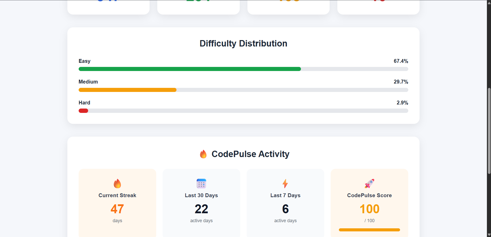
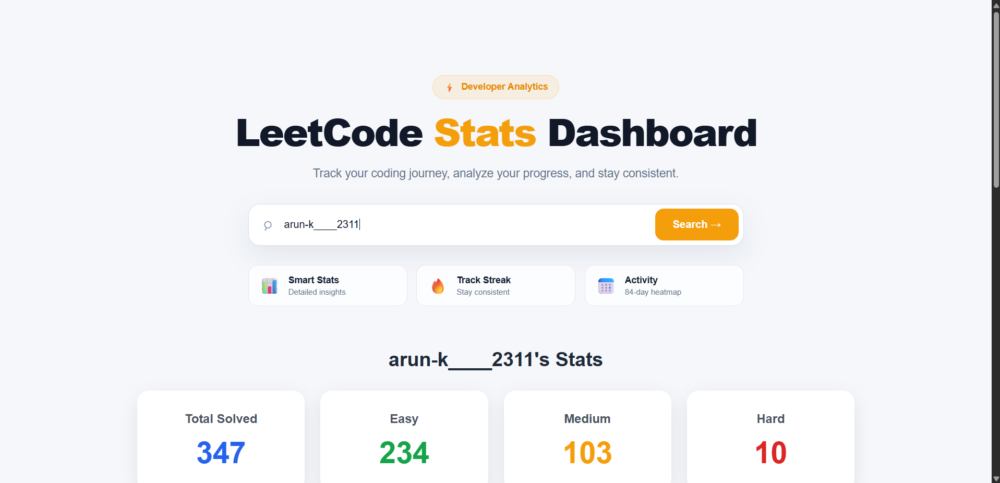

# 📊 LeetCode Stats Dashboard

> A full-stack developer analytics dashboard that fetches real-time LeetCode data and transforms it into a clean, visual, and easy-to-understand coding profile.

🚀 **Live Demo:**  
https://leetcode-stats-dashboard-frontend.onrender.com

---

## ✨ Overview

**LeetCode Stats Dashboard** is a full-stack web application built with React.js, Node.js, and Express.js.

It allows users to search for a LeetCode username and view their coding progress, problem-solving statistics, difficulty distribution, coding streak, recent activity, custom CodePulse Score, and coding activity heatmap — all in one place.

---

## 🚀 Features

- 🔎 Search LeetCode users by username
- 📊 Total problems solved
- 🟢 Easy problems solved
- 🟠 Medium problems solved
- 🔴 Hard problems solved
- 📈 Difficulty distribution
- 🔥 Current coding streak
- 📅 Last 7 days activity
- 📆 Last 30 days activity
- 🚀 Custom CodePulse Score
- 🟩 84-day coding activity heatmap
- ❌ Invalid username error handling
- ⚠️ Empty username validation
- ⚡ Real-time data fetched from LeetCode
- 📱 Responsive dashboard UI

---

## 🖥️ Live Demo

🌐 **Live Website:**  
https://leetcode-stats-dashboard-frontend.onrender.com

The application is deployed and ready to use.

Enter a valid LeetCode username and click **Search** to view the user's coding statistics.

---

## 📸 Screenshots

### 🏠 Dashboard

Main dashboard showing the username search interface and LeetCode statistics.



---

### 📊 Analytics

Difficulty distribution and CodePulse activity analytics.



---

### 🟩 Coding Activity Heatmap

An 84-day contribution-style heatmap showing the user's coding activity.



---

### ❌ Invalid Username Handling

The application displays a clear error message when an invalid LeetCode username is entered.



```text
LeetCode username not found
```

---

## 🛠️ Tech Stack

### Frontend

- ⚛️ React.js
- 🟨 JavaScript
- 🌐 HTML5
- 🎨 CSS3
- ⚡ Vite

### Backend

- 🟢 Node.js
- 🚂 Express.js
- 🟨 JavaScript
- 🔌 REST API

### Data Source

- 🟡 LeetCode GraphQL API

### Deployment

- Frontend → Render Static Site
- Backend → Render Web Service

---

## 📂 Project Structure

```text
Leetcode-Stats-Dashboard/
│
├── backend/
│   ├── server.js
│   ├── package.json
│   └── package-lock.json
│
├── frontend/
│   ├── src/
│   │   ├── App.jsx
│   │   ├── App.css
│   │   ├── index.css
│   │   └── main.jsx
│   │
│   ├── package.json
│   └── package-lock.json
│
├── screenshots/
│   ├── dashboard.png
│   ├── analytics.png
│   ├── heatmap.png
│   └── invalid-user.png
│
├── .gitignore
└── README.md
```

---

## ⚙️ How It Works

```text
User
  │
  ▼
React Frontend
  │
  │ HTTP Request
  ▼
Node.js + Express Backend
  │
  │ GraphQL Request
  ▼
LeetCode API
  │
  ▼
User Statistics
  │
  ▼
Backend Response
  │
  ▼
React Dashboard
```

### Data Flow

1. User enters a LeetCode username.
2. React sends the username to the backend.
3. Express receives the request.
4. Backend queries the LeetCode GraphQL API.
5. LeetCode returns user statistics and activity data.
6. Backend sends the required data to the frontend.
7. React displays the information in the dashboard.

---

## 📊 Dashboard Information

### Problem Statistics

The dashboard displays:

| Statistic | Description |
|---|---|
| Total Solved | Total number of solved problems |
| Easy | Easy problems solved |
| Medium | Medium problems solved |
| Hard | Hard problems solved |

---

### 📈 Difficulty Distribution

The dashboard calculates the percentage distribution of solved problems across:

- 🟢 Easy
- 🟠 Medium
- 🔴 Hard

The distribution is calculated based on the total number of solved problems.

---

### 🔥 Coding Streak

The dashboard displays the user's current coding streak in days.

---

### 🚀 CodePulse Score

**CodePulse Score** is a custom activity-based metric created specifically for this project.

It considers:

- Current coding streak
- Last 7 days activity
- Last 30 days activity

The score is displayed out of:

```text
100 / 100
```

> **Note:** CodePulse Score is a custom metric created for this project and is not an official LeetCode score.

---

### 🟩 Coding Activity Heatmap

The dashboard visualizes coding activity over the most recent **84 days**.

Different shades represent different levels of coding activity.

Hovering over a heatmap cell displays the corresponding date and submission count.

---

## 🔌 API

The backend exposes the following endpoint:

```http
GET /api/leetcode/:username
```

### Example

```text
http://localhost:5000/api/leetcode/arun-k____2311
```

The endpoint fetches LeetCode user statistics and activity data and returns the required information to the frontend.

---

## 🧪 Testing

The application has been tested with valid, invalid, and empty username inputs.

### ✅ Valid Username

```text
arun-k____2311
```

The dashboard successfully displays:

- Total problems solved
- Easy problems
- Medium problems
- Hard problems
- Difficulty distribution
- Current coding streak
- Last 7 days activity
- Last 30 days activity
- CodePulse Score
- Coding activity heatmap

---

### ❌ Invalid Username

Example:

```text
xyz_invalid_123456789
```

Expected result:

```text
LeetCode username not found
```

---

### ⚠️ Empty Username

When the search field is empty:

```text
Please enter a LeetCode username
```

---

## 💻 Run Locally

### 1. Clone Repository

```bash
git clone https://github.com/kumarun415/Leetcode-Stats-Dashboard.git
```

Navigate into the project:

```bash
cd Leetcode-Stats-Dashboard
```

---

## ▶️ Backend Setup

Open a terminal and navigate to the backend folder:

```bash
cd backend
```

Install dependencies:

```bash
npm install
```

Start the backend:

```bash
npm start
```

Backend will run on:

```text
http://localhost:5000
```

---

## ▶️ Frontend Setup

Open another terminal:

```bash
cd frontend
```

Install dependencies:

```bash
npm install
```

Start the Vite development server:

```bash
npm run dev
```

Vite will provide a local development URL in the terminal.

---

## 🔐 Environment Variables

The frontend uses an environment variable for the backend API URL.

Create this file:

```text
frontend/.env
```

Add:

```env
VITE_API_URL=http://localhost:5000
```

For production deployment, `VITE_API_URL` should point to the deployed backend.

> `.env` files should not be committed to GitHub.

---

## 🌐 Deployment

The project is deployed using Render.

### Backend

```text
Platform: Render
Service: Web Service
Root Directory: backend
Build Command: npm install
Start Command: npm start
```

### Frontend

```text
Platform: Render
Service: Static Site
Root Directory: frontend
Build Command: npm install && npm run build
Publish Directory: dist
```

The frontend communicates with the deployed backend through:

```text
VITE_API_URL
```

---

## 📱 Responsive Design

The dashboard is designed to work across different screen sizes:

- 🖥️ Desktop
- 💻 Laptop
- 📱 Mobile
- 📲 Tablet

---

## 🎯 Future Improvements

- 🏆 LeetCode Global Ranking
- ⭐ Contest Rating
- 📊 Acceptance Rate
- 👥 User Comparison
- 🌙 Dark Mode
- 📄 PDF Export
- 🔗 Shareable Profile
- 📈 Historical Analytics
- 🏅 Achievement System
- 📊 Advanced Activity Charts
- 🔔 Progress Notifications

---

## 📌 Project Status

| Component | Status |
|---|---|
| Frontend | ✅ Completed |
| Backend | ✅ Completed |
| LeetCode API | ✅ Integrated |
| Error Handling | ✅ Completed |
| Responsive UI | ✅ Completed |
| Screenshots | ✅ Added |
| Deployment | ✅ Live |

---

## 👨‍💻 Author

### Arun Kumar

**B.Tech Information Technology Student**

Interested in:

- Full-Stack Development
- React.js
- Node.js
- JavaScript
- Data Structures & Algorithms
- Problem Solving

---

## ⭐ Support

If you found this project useful or interesting, consider giving the repository a ⭐ on GitHub.

Your support is appreciated! ❤️

---

## 📄 License

This project is created for learning, portfolio, and educational purposes.